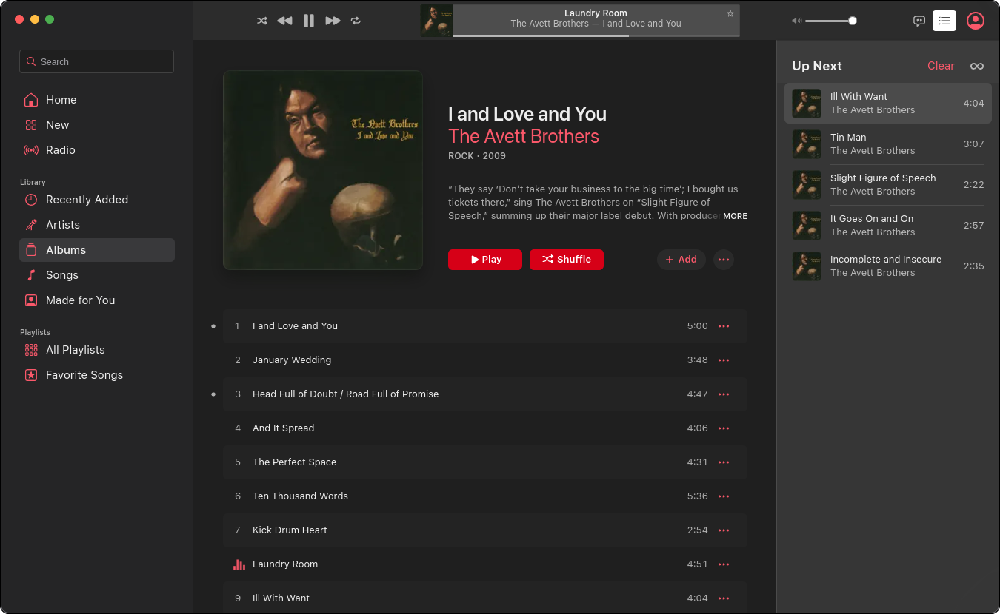

# 🍏 Apple Music Desktop App For Linux 🎵
### listen to your Apple Music libary on the Linux desktop



[![GitHub license][license-img]][license-url]
[![GitHub release][release-img]][release-url]

### ❔ How it works ❔
AM desktop is a wrapper built on electron that gives the [Apple Music](https://music.apple.com/) web player
a face lift to look like a desktop app
#### Window Transparency
By default the window is transparent allowing for rounded corners on the window.
Howver this may cause issues on certain desktops or if running on xwayland.

You can disable this by passing a enviorment variable or lanch argument.
```bash
# Enviorment variable
NO_TRANSPARENT=1

# Launch argument
--no-transparent=1
```
#### Wayland
If the app launches under xwayland and you want to use wayland you can set the following enviorment variable:
```bash
ELECTRON_OZONE_PLATFORM_HINT=wayland
```

### ⚠️ Known Issues ⚠️
passkey sign-in currently does not work.

## Developing

To clone and run this repository you'll need [Git](https://git-scm.com) and [Node.js](https://nodejs.org/en/download/) (which comes with [npm](http://npmjs.com)) installed on your computer. From your command line:

```bash
# Clone this repository
git clone https://github.com/electron/electron-quick-start
# Go into the repository
cd AMdesktop
# Install dependencies
npm install
# Run the app
npm start
# Build the app
npm run build
```
