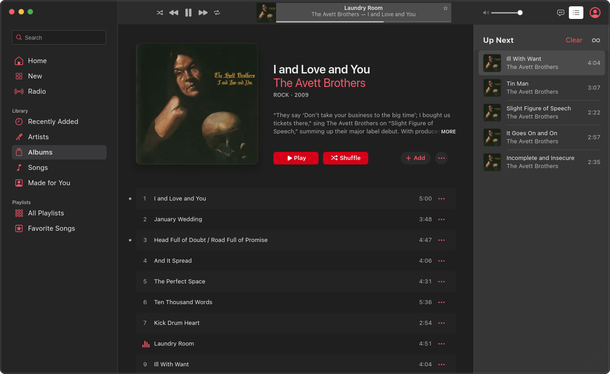

# 🍏 Apple Music Desktop App For Linux 🎵
### listen to your Apple Music library on the Linux desktop



### ❔ How it works ❔
AM Desktop is an Electron-based wrapper that gives the [Apple Music](https://music.apple.com/) web player a face lift,
making it resemble a desktop app and integrating seamlessly into your desktop.
#### System Tray
By default the window closes to the system tray allowing you to keep playing your music in the background.
However not all desktops may support this functionality.

You can disable the tray by setting a environment variable or launch argument:
```bash
# Environment variable
NO_TRAY=true

# Launch argument
--no-tray
```
#### Window Transparency
By default the window is transparent allowing for rounded corners on the window.
However this may cause issues on certain desktops or if running on xwayland.

You can disable this by setting a environment variable or launch argument:
```bash
# Environment variable
NO_TRANSPARENT=true

# Launch argument
--no-transparent
```
#### Wayland
If the app launches under xwayland and you want to use wayland you can set the following environment variable:
```bash
ELECTRON_OZONE_PLATFORM_HINT=wayland
```

### ⚠️ Known Issues ⚠️
* passkey sign-in currently does not work.
* some drop down context menus do not work.

## Developing

To clone and run this repository you'll need [Git](https://git-scm.com) and [Node.js](https://nodejs.org/en/download/) (which comes with [npm](http://npmjs.com)) installed on your computer. From your command line:

```bash
# Clone this repository
git clone https://github.com/TuxTheAstronaut/AMdesktop.git
# Go into the repository
cd AMdesktop
# Install dependencies
npm install
# Run the app
npm start
# Build the app
npm run build
